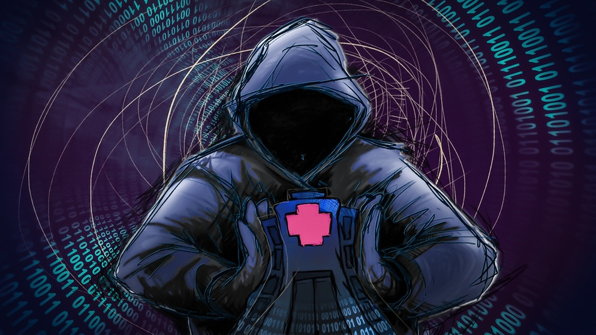

<a name="readme-top"></a>


<br />
<div align="center">
  <a href="https://github.com/othneildrew/Best-README-Template">
    
  </a>

  <h1 align="center">Are Smart Contract Attack Strategies Optimized?</h1>

  <p align="center">
    This work is in the frame of my Bachelor's thesis at the Technical University of Munich
    <br />
    <a href="https://github.com/TrungNguyen1409/Trung_BA/blob/main/Trung_Bachelor_Thesis.pdf"><strong>Research Paper »</strong></a>
  </p>
</div>


# Abstract

Since the first blockchain-based Decentralized Finance (DeFi) went online on the Ethereum
main net in 2017, DeFi Ecosystems have reached their peak in Total Value Locked (TVL)
of 258 billion USD. At the time of writing, although the market has been observing a bear
market, TLV in DeFi protocols has been very stable with protocols in two Ethereum Virtual
Maschine (EVM) compatible blockchains hold more than 60% of the market, Ethereum (33
billion USD, 52.94%) and BNB Smart Chain (4,475 billion USD, 7.17%). DeFi introduces a
variety of protocols inspired by traditional finance, such as cryptocurrency exchanges, lending
platforms, and derivatives. Additionally, it introduces innovative concepts like flash loans and
atomic composability in DeFi trading. Considering DeFi protocols’ transparency, they are prone
to many exploitations from adversaries with monetary motives. Thus, an interesting question
arises: Would the adversaries have been able to take advantage of the protocols differently using
different strategies?

For this thesis, we have conducted a comprehensive dataset of 147 high-impact real-world DeFi
incidents on Ethereum and BNB Smart Chain from May 01, 2022, to Oct 31, 2023. In that period, the reported damage value amounted to over 1 billion USD. The analysis is supported
by a State-of-the-Art Smart Contract fuzzer, which suggests that some of the attack strategies
are only sub-optimal. Finally, based on our dataset calculation, we conclude that the
rescue time frame for the defending party in a smart contract attack has decreased compared
to prior years.


# DeFi Incident Database

For this research, we have extended the original database collected by Zhou et. al (https://sok.defi.security/)
This extended database, you can find in this folder, under file "defi_sok_extended.db":

<a href="https://github.com/TrungNguyen1409/Trung_BA/tree/main/database)https://github.com/TrungNguyen1409/Trung_BA/tree/main/database"><strong>Database »</strong></a>

It is a SQLite database and we highly recommend using SQLite Browser client software to take a better look at the dataset.  (https://sqlitebrowser.org/)


# DeFi Incident Rescue Time Frame

The script in this folder allows you to calculate the rescue timeframe defined in the paper.

Make sure you have updated the DB with new incident entries (Adversary table in the DB) -> fill it with adversary smart contract. And also use your private Etherscan API KEY and BSC Scan API KEY

The script will automatically run through all entries and calculate the timeframe on each one.

Step 1: Install NPM packages
   ```sh
   npm install
   ```

Step 2: run the script
  ```sh
   node calculateTimeFrame.js
   ```


# Investigating Real-World Incidents with ITYFUZZ

1. Get a free API Key at [https://example.com](https://example.com)
2. Clone the repo
   ```sh
   git clone https://github.com/your_username_/Project-Name.git
   ```
3. Install NPM packages
   ```sh
   npm install
   ```
4. Enter your API in `config.js`
   ```js
   const API_KEY = 'ENTER YOUR API';
   ```
